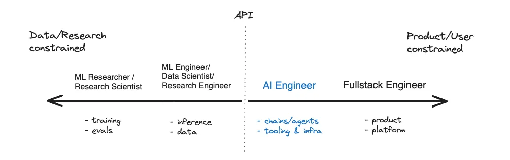

When I first started to learn about AI engineering in October of 2023, I was overwhelmed with jargon, academic papers, and more acronyms than I could handle. NLP? RAG? LLMs? DPO? RLHF? My head was spinning. I looked around for resources targeted at web developers new to AI, but couldn't find what I wanted. I needed someone to orient me to the landscape, give me a map, and help me figure out which direction to go. Instead, I just kept finding a bunch of Machine Learning resources and more confusion. 

I've been a friend and follower of Shawn Wang ([swyx](https://swyx.io/)) since his frontend days, so I started with his work on [Latent Space](https://www.latent.space/) and [The Rise of the AI Engineer](https://www.latent.space/p/ai-engineer). Eventually, I found my way around and learned enough to join [Writer](https://www.writer.com), an enterprise AI platform, as their Director of Developer Relations in Spring 2024. It wasn't easy though, and I could have really used a practical, high-level guide to help me understand the landscape and get started.

So, as is my custom, whether with [Developer Relations](http://www.gettingstartedindevrel.com), [AWS](https://www.samjulien.com/where-to-start-with-aws-as-a-developer), or [Obsidian](https://www.samjulien.com/get-started-with-obsidian-as-a-developer), I'm creating the guide I wished existed when I was getting started. 

I'll start with what I mean by AI engineering and why it matters, and then break down practical strategies for getting started with AI engineering. As always, this is based on my experience - take what works for you and adapt it to your needs!

If you want to skip all of the background, here are the strategies:
1. Use AI products to prototype and learn the fundamentals of interacting with LLMs
2. Learn the key skills for AI engineering by building with APIs and SDKs
3. Cross the divide into production AI engineering
4. Embark on advanced "side quests" as you can
5. Stay current by ignoring the hype and following the signal

## What is AI engineering?
There are a few different interpretations of what "AI engineering" as a discipline and "AI engineer" as a practitioner mean, but they essentially boil down to two:

1. Engineers who build and train models (Machine Learning-forward)
2. Engineers who build applications that use AI (Software-forward)

For this article, I'm using the latter definition. In many places, though, you'll still see the former. In fact, at my own company we use the term "AI engineer" to describe the team building our models. If you start seeing Machine Learning (ML) resources mentioned in an article or YouTube video, they're probably using that definition.

The software-forward definition is the one I'm using here, and it's the one I think is most relevant to web developers. It was coined by [Swyx](https://swyx.io/) and popularized by [Latent Space](https://www.latent.space/), particularly the following diagram:

*Swxy's AI engineering diagram*

The main idea here is that with the advent of transformer architecture (think: ChatGPT), developers can build AI applications at the API layer, without having to understand the underlying math or machine learning. This is a massive shift from the past, where building AI applications required a deep understanding of machine learning and statistics.

It's also a practical advantage, as there orders of magnitude more software engineers than machine learning engineers. This means that the barrier to entry for AI engineering is much lower than it was in the past, and it's a skill that can be learned by anyone with software development skills.

## Why AI engineering matters
Why this shift is happening and why does it matter so much?

Like many developers, I was initially skeptical of AI. We've all seen enough hype cycles in tech to develop a healthy dose of cynicism. But AI isn't just another tech hype cycle &mdash; it's decades of research finally reaching practical application, as Dr. Andrew Ng emphasizes in his talk ["Opportunities in AI"](https://www.youtube.com/watch?v=5p248yoa3oE). 

The big game being played here is the race toward Artificial General Intelligence (AGI) -- machines as capable as humans at most tasks. This pursuit could either transcend or endanger humanity, with ethical considerations around regulation, privacy, and security that can't be ignored.

AGI started as an academic pursuit, but as we've inched our way closer in recent years, billionaires have taken notice and are staking their claim, racing for more power and money. The main ones to be aware of are:

- Sam Altman and OpenAI, developing ChatGPT models and products
- Mark Zuckerberg and Meta, developing the Llama models and adding them to Meta products
- Satya Nidella and Microsoft, partnering with OpenAI and integrating AI into Azure
- Elon Musk and XAI, developing Grok models and, well, you know the rest
- Jensen Huang and NVIDIA, essentially dominating the entire hardware space for model training

Many of these major players have stated that they will sacrifice nearly anything in pursuit of this, citing the prediction that AGI will unlock trillions of dollars of value in the global economy as justification for everything from cutting ethical corners to raising billions in capital. 

There are massive ethical and safety considerations here, such as how we should or should not regulate the development of AI, how we must evolve privacy and security in this new era, how we should or should not police AI-generated "deepfake" content, and much more.

It's not an exaggeration to say that this is an "all of the marbles" scenario for humanity, and it's massively important that we approach it with care. If we're not careful, an unprecedented concentration of power could happen within our lifetimes. It's my goal to contribute to the spread of this knowledge and empower as many kind, good-hearted, ethically-driven developers around the world to make a difference in their own communities and quickly add to the growing list of major players in this space.

The good news is that there is currently not enough engineering talent to usher in this new era. Companies seem to be over-correcting for remote work during COVID and only wanting to hire in San Francisco and New York, but this isn't sustainable. The time to learn these AI engineering skills is now. As Swyx is fond of saying, "AI engineering is the last job."

## Strategies for shifting into AI engineering
Okay, so how do you actually make the leap from something like web development or developer advocacy to AI engineering?

Here are five strategies to transition from traditional software or web development into AI engineering:

1. Use AI products to prototype and learn the fundamentals of interacting with LLMs
2. Learn the key skills for AI engineering by building with APIs and SDKs
3. Cross the divide into production AI engineering
4. Embark on advanced "side quests" as you can
5. Stay current by ignoring the hype and following the signal

### Strategy 1: Use AI products to prototype and learn the fundamentals of interacting with LLMs
You don't need a deep ML background to become an AI engineer, but you do need to understand:
- How to work with LLMs effectively across text, images, and other modalities
- Basic prompt engineering principles
- When to use AI and when not to

Luckily, many AI products provide a smooth onramp to learning these fundamentals:

#### Mastering LLM interaction
The first step is understanding how to interact with LLMs through effective prompting. This means learning to give clear instructions, provide context, and understand how different inputs affect outputs. 

Best place to start is by asking the LLMs you're using.

Resources like [Sarah's prompting guide](https://exaai.notion.site/Prompt-Engineering-Best-Practices-0839585d4bce4c6abb0b551b2107a92a) and the [Instructor prompt design site](https://python.useinstructor.com/prompting/thought_generation/chain_of_thought_zero_shot/thread_of_thought/) offer excellent starting points.

Better prompting links

For code generation, tools like Bolt, Replit, Cursor, and Windsurf provide practical environments to experiment with AI-assisted coding. The key insight is seeing how bringing in context through project files or documentation dramatically improves what LLMs can generate.

John Lindquist

#### Exploring multi-modality
Beyond text, modern AI systems handle images (Computer Vision) and speech (Automatic Speech Recognition). Products like ChatGPT, Claude, and Gemini let you upload images and get analysis or generate text based on visual content. This multi-modal capability represents the future of AI interfaces.

These products also introduce more advanced concepts in AI engineering. For example, web search functionality is a subtle introduction to tool calling, while Deep Research by ChatGPT and Google Gemini demonstrates the power of AI agents.

For just starting out, I recommend DeepLearning.AI's [Generative AI for Everyone](https://www.coursera.org/learn/generative-ai-for-everyone/) course.

### Strategy 2: Learn the key skills for AI engineering by building with APIs and SDKs
Once you're comfortable with the basics, it's time to start building with AI through APIs and SDKs. You'll want to learn a core set of essential skills that represent the evolution of backend engineering:

The most immediate opportunity for web developers is in combining existing AI tools effectively. I see successful AI engineers spending more time on:
- Integrating AI capabilities into existing applications
- Implementing RAG (Retrieval Augmented Generation)
- Building systems that combine multiple AI tools
- Building AI agents

#### Transferable engineering skills
Many core engineering skills you already possess directly transfer to AI engineering:
- Debugging complex systems
- Writing automated tests
- API integration
- Data transformation
- System architecture design
- Version control and deployment

The key is understanding both what AI can do well (code generation, data analysis, content creation) and what still needs human oversight (system architecture, user experience, business logic).

#### The AI reasoning stack
When building AI applications, I think about three core layers:
1. **LLM layer** - The foundation models that power your application (OpenAI, Anthropic, open-source models)
2. **Data layer** - How you bring context to the LLM through RAG, fine-tuning, or other methods
3. **UX/UI layer** - How users interact with and experience the AI capabilities

#### Choosing the right model
With new models released almost weekly, choosing the right one is crucial. Consider:
- Task requirements (text generation, code, multi-modal capabilities)
- Cost and latency constraints
- Privacy and data security needs

Resources like LLM leaderboards and benchmarks can help, but nothing beats testing models with your specific use cases and datasets.

#### Working with APIs and SDKs
Start by learning to use the Python or TypeScript SDKs for major providers like OpenAI, Anthropic, or Gemini. These let you integrate AI capabilities directly into your applications.

Note: Though many tools now offer JavaScript/TypeScript SDKs, you will inevitably need to learn at least some Python, as the vast majority of AI engineering work is still happening in Python. I've been learning Python gradually as needed, using LLMs to help with the transition. LLMs are great at translating between languages!

There are a boatload of free resources for learning Python. Start with this [Python Programmers Beginner's Guide](https://wiki.python.org/moin/BeginnersGuide/Programmers), a curated list of Python tutorials, books, and resources maintained on the Python Wiki.

#### Building RAG applications
Retrieval Augmented Generation (RAG) is one of the most important patterns in AI engineering. It involves retrieving relevant information from your own data sources and feeding it to an LLM to generate more accurate, contextual responses. This requires understanding:
- Vector databases and embeddings
- Text chunking strategies
- Search and retrieval methods
- Prompt engineering for RAG systems

#### Tool calling and structured outputs
Modern LLMs can both parse structured input and generate structured output. Learning to work with function calling allows your applications to:
- Extract specific data points from text
- Generate valid JSON or other structured formats
- Call external APIs based on user requests
- Validate and enforce output schemas

#### Orchestrating multiple LLMs
As applications grow more complex, you'll often need to coordinate multiple LLM calls in sequence or parallel. This is where agent frameworks come in, allowing you to build systems that can:
- Break complex tasks into subtasks
- Maintain context across multiple interactions
- Make decisions about which tools or models to use
- Handle errors and edge cases gracefully

I highly recommend checking out DeepLearning.AI's [short courses](https://www.deeplearning.ai/short-courses/), which provide an excellent foundation in these concepts. I also really like Scrimba's [AI Engineering path](https://scrimba.com/paths/ai-engineering).

For curated resources, follow [swyxio/ai-notes](https://github.com/swyxio/ai-notes). To dig deeper into production-level AI engineering, check out Shawn and Noah's Level Up course and Chip Huyen's book [AI Engineering](https://www.chiphuyen.com/ai-engineering-book).

### Strategy 3: Cross the divide into production AI engineering
As you get AI projects under your belt with APIs and SDKs, you'll soon learn that there is a large chasm between proof-of-concept, hobby projects and real, production-grade AI applications. As with many things, this level of complexity is where the real money is, and where the career path leads. If you can help companies escape what we call at Writer "POC purgatory," you'll separate yourself from the masses who are simply vibe coding with LLMs and hoping for the best.

Most of the complexities of production-grade AI applications stem from two major issues:

1. LLMs are fundamentally non-deterministic
2. Real world and enterprise data is messy

Notice that only one of those problems has anything to do with AI. This holds true: most of the problems with AI engineering are age-old data and software problems. LLMs add a new layer of complexity, as well as new modalities, but also don't change the fundamental problems of software engineering.

#### Testing LLM output
Unlike traditional software where inputs predictably map to outputs, LLMs add a layer of probabilistic behavior that makes testing challenging. Effective production systems require:

- **LLM unit tests** that verify core functionality while accommodating variance
- **Evaluation frameworks** (known as "evals") that measure output quality across dimensions like factuality, toxicity, and coherence
- **Quantifiable metrics** that translate subjective "vibes" into measurable benchmarks

Resources like [Parlance Labs' Evals Education](https://parlance-labs.com/education/evals/), [Forest Friends](https://forestfriends.tech/), and Weights & Biases' [evals course](https://wandb.ai/site/courses/evals/) provide excellent starting points.

#### LLM-as-judge techniques
One fascinating approach to evaluation is using LLMs themselves as judges. Hamel Hussain's [LLM Judge](https://hamel.dev/blog/posts/llm-judge/) work and Eugene Yan's [writing on LLM evaluators](https://eugeneyan.com/writing/llm-evaluators/) offer compelling frameworks for this approach.

Replace with Weave and LangSmith
Tools like [Firecrawl's Crawlbench](https://www.firecrawl.dev/blog/crawlbench-llm-extraction) and [Langfuse](https://langfuse.com/) help automate and scale these evaluations in production environments.

#### Advanced RAG techniques
Production applications often require more sophisticated RAG approaches than simple vector similarity:

- **Graph RAG** leverages relationships between pieces of information
- **Hybrid retrieval** combines multiple search methods
- **Multi-stage retrieval** filters and refines search results in sequence
- **Re-ranking** improves relevance by re-scoring initial search results

Add course link
Jason Liu's work on advanced RAG architectures has been particularly influential in this space.

#### Production-grade function calling
Beyond basic function calling, production systems need:
- Robust schema validation
- Fallback mechanisms for invalid outputs
- Cost and latency optimizations
- Versioning strategies for evolving schemas

#### Enterprise-ready agent orchestration
When moving beyond simple agents to production systems, you need:
- Monitoring and observability
- Robust error handling
- Rate limiting and cost controls
- Secure handling of sensitive data

### Strategy 4: Embark on advanced "side quests" as you can

These areas might not be the core of AI engineering but offer valuable expertise and opportunities as either fun hobby projects or specialized career paths.

#### Model deployment and inference
Understanding where and how to host models involves crucial tradeoffs between:
- Latency requirements
- Cost constraints
- Security considerations
- Scale needs

While many developers can rely on API providers like OpenAI and Anthropic, knowledge of inference optimization becomes crucial for specialized applications or when working with open-source models.

Together
Modal

#### Self-hosting and local execution
Tools like [LM Studio](https://lmstudio.ai/) allow running smaller models locally, which can be valuable for applications with privacy requirements or offline needs. Understanding the tradeoffs between cloud APIs and self-hosted models helps you make better architectural decisions.

#### Infrastructure and LLMOps
Services like [Modal](https://modal.com/) simplify deploying AI applications without managing complex infrastructure. Charles Frye's [work](https://x.com/charles_irl) provides excellent insights into this space, and Modal's [GPU glossary](https://modal.com/gpu-glossary/readme) helps demystify GPU selection.

#### Open-source models
The landscape of open-source LLMs is evolving rapidly, with models like Llama, Mistral, and Falcon offering compelling alternatives to closed APIs. Nathan Lambert's research provides excellent guidance on when to use open vs. closed-source models and their relative strengths.

#### Fine-tuning
While not always necessary, fine-tuning models on domain-specific data can dramatically improve performance for specialized tasks. Learning when and how to fine-tune is a powerful skill, though one that requires more ML background than other areas of AI engineering.

### Strategy 5: Stay current by ignoring the hype and following the signal
One of the biggest challenges in AI engineering is keeping up with the rapid pace of change while filtering out the noise. Four major areas of both conflict and growth are currently shaping the future of AI:

- **Model development and architecture**

- **Data:** Who owns and controls training data, running out of data, how do you create data (synthetic data)
- **GPU/Inference:** How we train and run models efficiently
- **Multimodality:** Competition in different types of AI like image, video, and speech
- **LLMOps:** How we build and deploy AI applications

Understanding these battles helps you see where the opportunities lie for developers. 

Here are three reliable sources of signal:

#### Follow smart people
The signal-to-noise ratio in AI content is particularly challenging. The Applied LLMs crew provides consistently practical insights into building real applications. Nathan Lambert offers clear-eyed analysis of the latest models and research without the hype. Finding a handful of trustworthy voices helps cut through marketing and speculation to focus on what works.
Swyx high signal list
NLW

#### Join community discussions
Discord servers like [Latent Space](https://www.latent.space/) connect you with other practitioners and provide real-time discussion of new developments. These communities often surface practical applications of new research far before formal courses or books can be updated, and the shared learning environment helps everyone progress faster.

Remember, you don't need to know everything. Focus on understanding the fundamentals and keeping an eye on major developments that affect your work directly. The developers who will thrive aren't necessarily the ones who know the most about machine learning theory--they're the ones who can effectively combine AI capabilities with solid engineering principles to solve real problems.

#### Start learning about AI and ML research
While you don't need to understand every research paper, developing basic literacy in AI research helps you anticipate where the field is heading.

Paper Club experience

- Shawn's [2025 Papers](https://www.latent.space/p/2025-papers) highlights key research to watch
- Eugene Yan's [guide on starting a paper club](https://eugeneyan.com/writing/paper-club/) offers a structured approach to research literacy
- His [list of notable papers](https://github.com/eugeneyan/llm-paper-notes) provides a curated starting point
- Following major research conferences like NeurIPS helps identify emerging trends before they reach mainstream adoption

Foreign language 
It’s a lot like learning a foreign language and you’ll pick it up gradually as you go.  As someone here told me in June: be patient, give it time, and don’t stress too much about what you’re not understanding. Just keep showing up, reading, and letting the papers wash over you. The paper understanding compounds thankfully.

Use ChatGPT/Claude to expain *anything* that I don't understand.  I've found that I often get derailed by terminology and references to things that are taken for granted by people in the field.  If I don't understand a concept, I will usually spend the time to dive in and get a high level understand of each concept that I'm missing. This takes some extra time in the beginning, but rewards itself with a much more complete understanding of the paper on which to build.  I've found this accelerates bootstrapping a new area of learning dramatically

2. There are usually one or two papers that the paper depends on.  I generally also read those in pretty significant detail in order to understand the core concepts of the original paper.  This is similar to  #1, but also independently important because papers basically never stand alone: they are part of a conversation that researchers are having with each other, so it is very helpful to understand what the paper is building upon.

## The Path Forward

Nobody knows exactly how fast AI will transform development - I've heard predictions ranging from "we've got a decade before AGI" to "AI agents will change everything within a year." The reality is probably somewhere in between, but the direction is clear.

Here's what I recommend focusing on:
1. Get comfortable with AI tools - they're becoming as fundamental as learning a new programming language
2. Build your orchestration skills - the ability to combine different AI tools effectively is increasingly valuable
3. Maintain your engineering judgment - AI can generate code, but understanding architecture and user needs remains crucial
4. Stay curious but practical - focus on solving real problems rather than chasing the latest AI trend

You can do this! Reach out if you have questions.​​​​​​​​​​​​​​​​