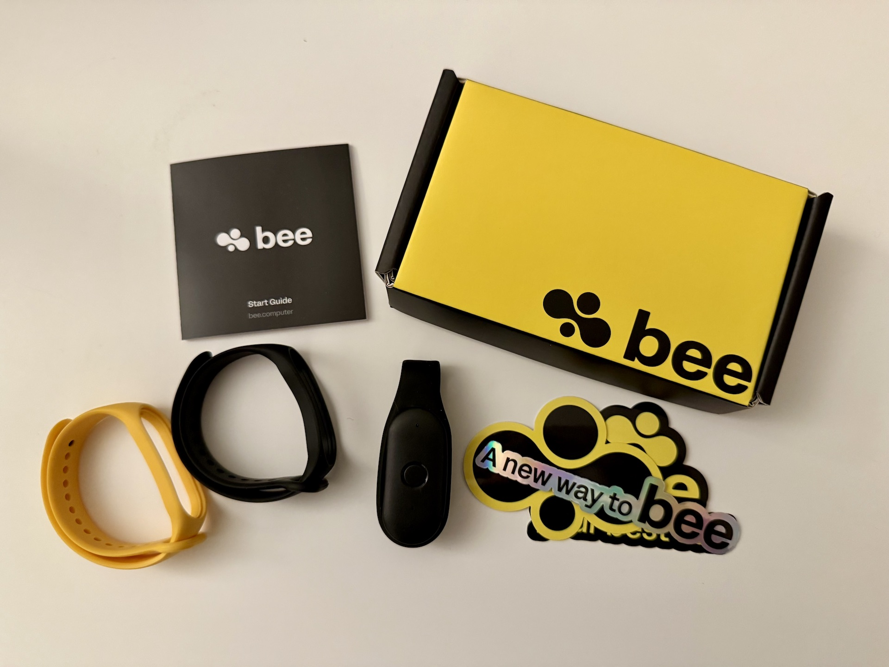

I recently got my hands on the [Bee AI wearable](https://www.bee.computer/) after listening to the interview with [Maria](https://x.com/mariadlzollo) and [Ethan](https://x.com/EthanSutin) on [Latent Space](https://www.latent.space/p/bee). I've been testing it out over the past few days and wanted to share my initial thoughts on this fascinating device that's designed to provide augmented memory through AI.

First, I have to give credit to the Bee team for actually shipping a product in this space. Anyone who's followed hardware startups knows that getting from concept to delivered product is no small feat!

## What is the Bee?

For those who haven't been following this space, the Bee is a wearable AI device designed to provide augmented memory capabilities. It's a small, lightweight device that you wear throughout your day, where it listens to your conversations and activities. Using AI, it transcribes what it hears, organizes this information, and makes it searchable and useful through a companion app.

The core concept behind the Bee is to serve as an extension of your memory - capturing moments, conversations, and thoughts that might otherwise be forgotten. Unlike smart glasses or watches that focus on notifications or information display, the Bee concentrates specifically on memory augmentation and personal knowledge management.

## Privacy first approach

Before diving into my experience, I think it's important to highlight Bee's stance on privacy, which they shared on Discord in January:

- They don't store audio
- You control your data
- They never use your data
- They conduct third-party security audits
- All data is encrypted at rest and in transit
- They're working on a local version

In the current landscape, this level of commitment to privacy is refreshing and was definitely a factor in my decision to try the device.

## Hardware impressions

The device itself is surprisingly lightweight. Despite being made primarily of plastic, the build quality feels solid. You can tell a lot of thought was put into the design and presentation of the device. It’s lightweight and has good battery life without feeling super cheap.

I particularly appreciate the physical button that clicks when pressed to mute and unmute recording. The tactile feedback means I always know whether I’m being recorded or not. I haven’t experienced any accidental unmuting during sensitive conversations, which is crucial for a device that’s listening continuously.

By the way, I'm currently wearing the Bee on my wrist. I tried using it as a pendant clipped to my lapel at first, but my beard got in the way and was causing lots of errors. I’ve got it on my opposite wrist from my Apple Watch. It looks pretty silly wearing something on each wrist, but I really only am wearing it when I’m doing productive things and not when I’m out with my family or anything like that.

One minor issue that others have brought up is the lack of instruction on charging for the device. It’s so small that I’ve got to believe the power requirements are very low, so it would be good to include some information on how powerful a charger you need. I’m sure they’ll address this in the future.

## The Good: Hands-free memory augmentation

What I'm enjoying most about the Bee is the ability to capture thoughts while working on things or going for a walk without having to pull out my phone or watch. The always-on listening capability means I can simply speak naturally, and the Bee will record that information.

This hands-free approach reduces the friction in documenting ideas and observations throughout my day. I've found myself recording more thoughts than I typically would because the process is so effortless.

### Daily summaries and smart suggestions

One of the most valuable features is the daily summary at the end of each day. The Bee compiles what happened and analyzes my sentiments about different events and interactions. This reflection helps me process the day and identify patterns I might otherwise miss.

The Bee also proactively suggests to-do items based on my conversations and activities, which has proven surprisingly useful. I can simply accept or reject these suggestions as they come in, creating a low-friction way to build my task list.

The system works with the concept of "facts" &mdash; long-term information for the assistant to remember. The Bee proactively suggests these facts based on your conversations. While this feature still has some bugs, it genuinely improves the quality of transcripts and summaries over time.

### Interactive assistant

The chat feature with the built-in assistant has proven pretty useful for day preparation and reflection so far. The assistant retains context from your recordings, making conversations more relevant and personalized.

For those comfortable with deeper integration, you can optionally grant the Bee access to your email, contacts, and calendar. This additional context allows the assistant to provide more tailored support throughout your day. I appreciate that these integrations remain optional, staying true to their privacy-first approach.

## The API: Community innovation

A standout feature is their [API for developers](https://developer.bee.computer/), which allows developers to create extensions and tools around the core functionality. Community members are already building useful additions, including this [facts consolidator](https://github.com/imatson9119/bee-ai-fact-consolidator) that helps organize the information the Bee collects.

This open approach suggests the team understands that the real value will come from an ecosystem of tools rather than trying to build everything themselves. Data is really messy, especially speech data, so giving users the ability to clean it up themselves programmatically is a great idea.

## Current limitations

The Bee is clearly an early product with some notable growing pains. The speaker detection feature has significant bugs, making the manual tagging and untagging process in the app somewhat tedious. As of now, this also isn't exposed in the API, although I'm guessing it will make it there eventually.

For now, I've found it best to avoid tagging anyone other than myself and essentially ignore the contacts feature. I'm confident these issues will be addressed in future updates, but current users should set their expectations accordingly.

## Overall impressions

Despite the early-stage limitations, I’m finding genuine value in the Bee. It feels like a project from a team passionate about solving the problem of augmented memory, rather than a cash grab from a large corporation.

The privacy-conscious approach, the physical design considerations, and the open API all point to thoughtful product development. The Bee has huge potential, and I’m excited to see how it evolves as the team continues to refine the experience.

For those interested in augmented memory and willing to work through some early adoption challenges, the Bee offers a glimpse into a future where our digital assistants can more seamlessly integrate into our daily lives.

Have you tried any wearable AI devices? I’d love to hear about your experiences or answer any questions about the Bee.
